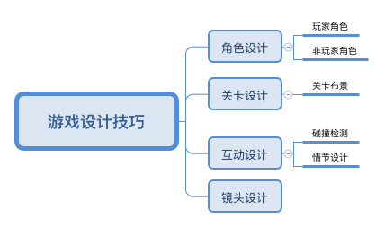

# 《游戏设计的236个技巧：游戏机制、关卡设计和镜头窍门》阅读计划

——图灵游戏开发与设计群阅读计划（第1期）

 

**领读人：nodegetout（叶小静）**

**本书特色**

- 游戏设计元素清晰的划分  
全面讲述了3D游戏开发和设计中需要注意的细节和技巧，主要划分为游戏机制（角色之间，角色与场景之间等）、关卡设计（场景布局）以及镜头运用的技巧三个大模块，细化为角色设计、关卡设计、互动设计以及镜头设计

- 经典的案例配图说明  
本书所附注说明的案例都十分经典，并且配有详细的经典案例和配图说明
- 理论和实践并重  
读者可以在通读一遍之后，根据自身需求，选取对应的技巧应用于实际3D游戏设计，或者作为平时设计游戏查阅的工具书

**图书类型** ：理论提升类、查阅工具类

**适合读者**  

- 游戏设计相关从业者（策划、关卡设计、场景设计以及游戏程序员）和兴趣爱好者

**阅读时间**

- 总阅读时长（预估）：4周 

- 每天阅读用时：2—3小时

- 答疑时间安排：每周一次，每周五晚游戏开发与设计学习群 20:00—22:00

---

## 阅读建议

- 建议大家可以预先学习基础的 Unity3D 的游戏实现，有构建原型能力即可，在通读的过程当中使用 Unity3D 实践当中的设计技巧，并且可以构建自己游戏设计的技巧原型库

- 虽然本书多达628页，但可以总结归纳为下图的框架。阅读的过程中，会发现，其实每个主题都是以不同的角度出发阐述其他主题的内容

上图中的互动设计包括玩家与角色之间、角色之间、角色和场景之间的反馈设计等互动的设计

#### 备注

学习Unity3D原型构建：

- 推荐视频教——pluralsight game prototyping in unity
- 推荐书籍《Unity游戏设计与实现：南梦宫一线程序员的开发实例（修订版）》

 

## 阅读规划

### 第1周：第一部分（第1—2章）

#### 重点内容

1.	了解游戏设计当中角色设计的相关技巧（玩家角色与非玩家角色）

2.	大致了解本书的写作风格，熟悉实现玩家角色和非玩家角色之间的差异

3.	玩家角色控制机制以及战斗机制的设计（动作、物理反馈及自身属性）

4.	非玩家角色（敌人）的分类和对应的设计

#### 难点内容

1.	玩家角色的战斗动作设计技巧，通过动作设计技巧提高沉浸感

2.	非玩家（敌人）的动作、AI机制和镜头设计

3.	各种玩家角色和非玩家角色之间的设计差异，及角色之间互动方式设计

#### 备注

- 不同的游戏类型，以及设计师所设定的特性，会导致设计的角色玩家和非玩家角色（敌人）所需要实施的技巧不同。如何在实际当中，根据游戏产品特质的选择有针对性和与众不同的机制是关键点。

- 另外，本书缺少的一些游戏类型的角色设计，譬如格斗竞技类（生或死、铁拳和街头霸王）可能需要读者自行去探索实践和总结。

- 大家在阅读过程中可以利用 Unity3D 内置的案例资源，针对性地实现对应的不同玩家和非玩家（敌人）控制和关卡的原型，实际体验不同机制的关键。

### 第2周：第二部分（第3章）

#### 重点内容
1.	各种游戏关卡设计技巧：探索、动作、恐怖、潜行、冒险等

2.	关卡的沉浸感提升，目标是超越电影体验的关卡设计

#### 难点内容
1.	明确所设计的游戏特质：开放式与封闭式、动作所需要营造的氛围

2.	如何让设计的关卡具有更为有趣、沉浸感更强以及耐玩性更高的特点

3.	关卡设计中的布景、互动设计以及动作设计等

#### 备注

-  本章主要内容为关卡设计，分类讲述了关卡设计中的场景设计、动作设计以及镜头设计等相关部分内容的设计技巧。在阅读过程中，推荐最好利用现成的Unity3D工包具构建对应的关卡原型进行体验，体会不同关卡设计的差异。

### 第3周：第三部分（第4章）

#### 重点内容
1.	3D游戏中不同类型的互动（碰撞检测）设计

2.	角色之间互动的基础概念和处理（玩家之间，玩家与非玩家）

3.	角色与环境之间的互动

4.	在互动过程中的镜头设计

#### 难点内容
1.	角色之间攻防的互动

2.	角色与场景环境之间的互动，及其中的布景设计

3.	互动过程中镜头的设计技巧

#### 备注

- 本书花费了一章的内容，向读者描述了以角色为中心的碰撞检测设计的一些技巧、关键问题点以及镜头的设计。其主要的作用就是在关卡设计中，需要明确如何让角色和游戏所设定的世界进行互动。

- 该章节不建议构建具体的原型体验，有条件的可以找对应或类似的游戏案例进行体验即可。

### 第4周：第四部分（第5章）

#### 重点内容 

1.	3D镜头的基础概念和特性

2.	运用镜头时需要遵循的原则和避免的问题

3.	镜头语言的信息表达，氛围烘托（恐怖、动作以及FPS等）

4.	固定镜头与运动镜头需要注意的问题

#### 难点内容

1.	3D镜头的运用基础

2.	固定镜头的相关机制设计

3.	运动镜头的相关机制设计

4.	FPS类型游戏的镜头运用

#### 备注

- 本章节是全书的亮点和难点，因为镜头语言其实主要来自影视设计，有一门专门的课程《视听语言》；在游戏设计当中，某些影视镜头语言的规则还是适用的，但是因为游戏是互动的过程，所以有自身的特点。因此，大家可以参阅扩展阅读中理论提升的两本书，除了涉及本书的大部分内容，也扩展为互动叙事的范围，是超越游戏设计的另一个大领域。

## 延伸阅读

**理论提升类**

- 《人机交互与戏剧表演:用戏剧理论构建良好用户体验（原书第2版）》
- 《游戏大师Chris Crawford谈互动叙事》

**实际应用类**

- 《Unity游戏设计与实现：南梦宫一线程序员的开发实例（修订版）》

